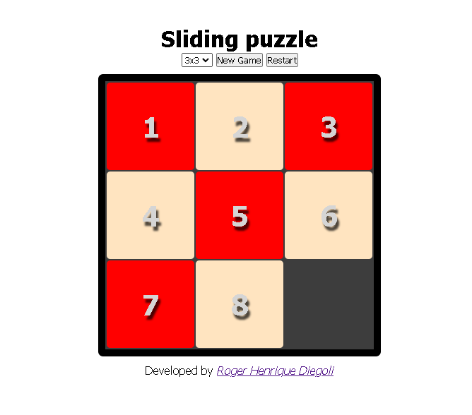

**Sliding Puzzle**

O Sliding Puzzle, também conhecido como 15 Puzzle, é um jogo de quebra-cabeça clássico onde o objetivo é organizar peças numeradas em ordem crescente, movendo-as em um espaço vazio. Cada peça só pode ser movida para o espaço vazio, tornando o jogo um desafio de lógica e estratégia.

## Funcionamento

O tabuleiro é uma grade quadrada com peças numeradas dispostas aleatoriamente. O jogador pode mover as peças na horizontal ou vertical, uma de cada vez, tentando rearranjá-las para alcançar a configuração correta. O jogo é concluído quando todas as peças estão em ordem numérica, com a peça vazia na posição desejada.

## Implementação

Este projeto implementa o Sliding Puzzle em HTML, CSS e Javacript, proporcionando uma experiência interativa para os usuários resolverem o quebra-cabeça. A interface gráfica intuitiva e as funcionalidades de movimentação tornam a experiência de jogo envolvente.

## Como Jogar

1. **Iniciar o Jogo:** [Link para o Projeto](https://rogerhenriquediegoli.github.io/Slide_Game/)
2. **Movimentar Peças:** Use seu mouse para clicar nas peças especificas e movê-las.
3. **Objetivo:** Organize as peças em ordem numérica para vencer o jogo.

Divirta-se resolvendo o Sliding Puzzle!
